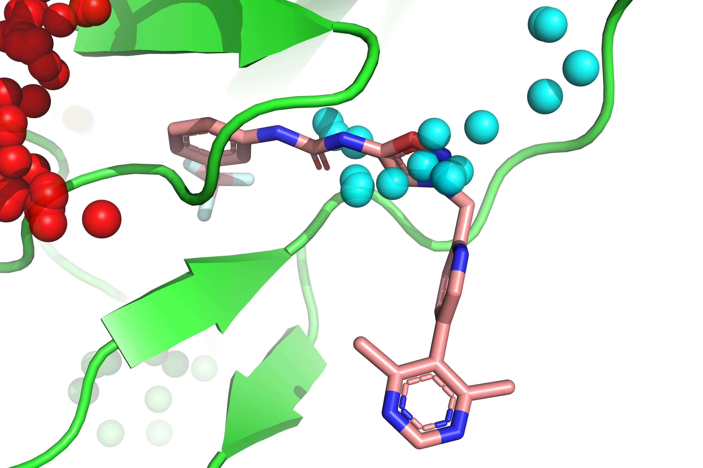

# Allosteric Site Predictor

A computational tool for predicting allosteric binding sites in proteases.

## Model Weights

Before running the predictions, please download the pre-trained model weights from the link below:
* [Download Model Weights (Google Drive)](https://drive.google.com/drive/folders/12Bc0sAMHMfufchIPJHSxfxdOIDEZairn?usp=sharing)

## Result
# Pocket Analysis Results

Here is the integrated table combining predictions from `#deepallo` and `#PASSer`. 

| pocket_id | probability (deepallo) | PASSer_prob/score | residue_count | residue_indices |
| :--- | :--- | :--- | :--- | :--- |
| 2 | 0.2060280591249466 | 32.5939804315567 | 11 | ['88', '89', '90', '91', '106', '111', '122', '123', '124', '125', '130'] |
| 7 | 0.12794001400470734 | 4.053217053296976 | 10 | ['90', '91', '92', '101', '117', '118', '119', '121', '122', '123'] |
| 8 | 0.12659141421318054 | 7.211269082472427 | 11 | ['85', '86', '87', '105', '106', '107', '163', '203', '205', '209', '211'] |
| 5 | 0.11184284090995789 | 7.775978102290537 | 10 | ['190', '191', '193', '195', '196', '197', '200', '215', '216', '217'] |
| 4 | 0.071338952 | 16.134672868793132 | 15 | ['138', '139', '141', '148', '150', '152', '185', '188', '211', '212', '213', '214', '217', '218', '220'] |
| 9 | 0.059825961 | 7.80872536561219 | 7 | ['115', '120', '132', '133', '134', '135', '142'] |
| 3 | 0.059603281 | 9.065918065607548 | 10 | ['89', '91', '94', '98', '99', '100', '167', '168', '169', '170'] |
| 1 | 0.058998033 | 29.03157570399344 | 11 | ['157', '158', '159', '160', '161', '175', '177', '205', '206', '207', '209'] |
| 10 | 0.030580176040530205 | 8.18419534698478 | 9 | ['154', '156', '157', '177', '178', '179', '180', '187', '221'] |
| 6 | 0.011041750200092793 | 8.021063399792183 | 8 | ['153', '154', '155', '158', '159', '206', '207', '208'] |
| 11 | 0.006024292 | 5.439323009341024 | 7 | ['107', '108', '150', '151', '152', '210', '211'] |

## Image of pocket5 (https://doi.org/10.1038/s41467-026-68943-x)

## Usage

You can run the prediction by specifying the model path, the target PDB file, and the desired output filename. 

Here is an example command:

```bash
python predictallo.py \
  --model_path /path/to/ag-20250812_114407 \
  --local_pdb ns2bns3.pdb \
  --output ns2bns3.csv
